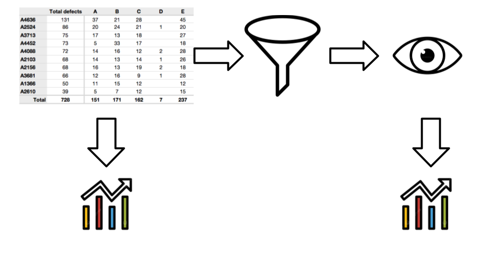

# Galyleo Data Architecture And Flow

The data flow in Galyleo is shown here.  Data is produced in a Jupyter Notebook, and then sent to a dashboard via the Galyleo library.  The object sent to a dashboard is a Table, which is conceptually a SQL database table -- a list of columns, each with a type, and a list of list of rows, which form the Table's data.  The data is then optionally passed through *filters*.  A *Filter* is a user interface element that selects a value (or range of values) from a column.  This can be used to choose subsets of rows from a particular table, to create what we call a *View*.

A *View* is a subset of a table; a selection (and, potentially, a reordering) of the columns of a table, and a subset of its rows, chosen by one or more Filters.  Static  charts can take as input *Table*; these charts display the same data, independent of user actions.  Dynamic charts take as input a View, which shows the data as filtered by the user  through user inputs.  

