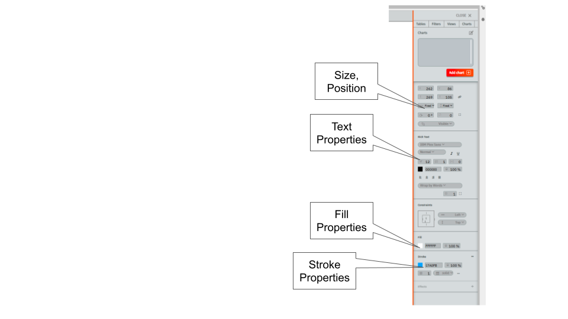
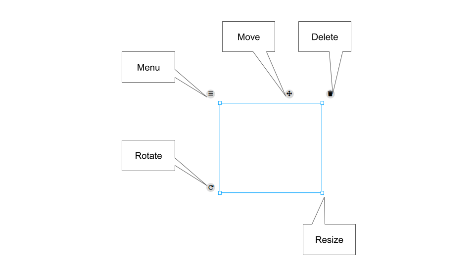
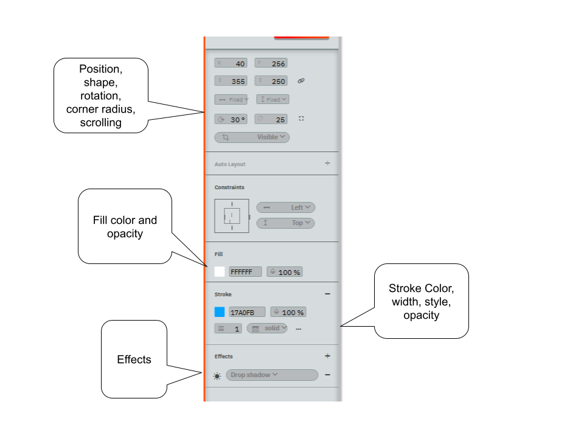
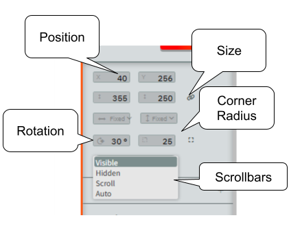
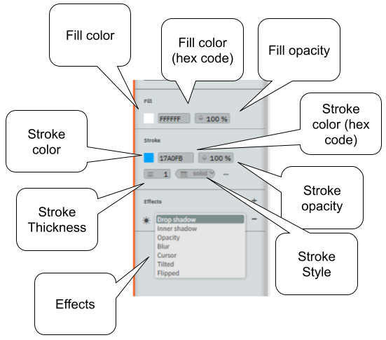
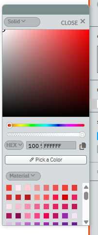
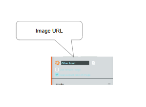

## The Halo and the Side Bar

The Halo and the Side Bar are used to configure an object when it's created, and can also be used to configure physical properties of charts and filters.  The Halo automatically appears when an object is clicked on and Selection mode is enabled (the arrow icon in the top bar).  The side bar automatically appears when a shape or text is created, or when the knob in the middle of the sidebar is clicked.  

The Halo shows control points and tools around the selected object.  The eight control points in the inner halo are used to change the width and height of the object.  The tool in the bottom-left corner is used to rotate the object.  The cross on the top bar is used to move it.  The trash can on the top right is used to delete the object.  The menu offers specific options, depending on the type of object.  These are explained  in the next section.

The Side bar consists of two parts.  The top one, which we'll return to later, manages Tables, Filters, Views, and Charts.  The bottom part is used to configure objects.  It has multiple sections, each activated by clicking on the chevron next to the name.

The *Shape* configurer is shown in the image, with its  components shown.  They are used to configure physical properties of an object, including its position, rotation, size, scrolling, fill (color), stroke, opacity of the object, and other effects such  as whether the object casts a drop shadow. 

Position, rotation, and size are controlled from the position controller.

Fill, stroke, and effects are controlled from the stroke, fill, and effects controllers.

When stroke or fill color is clicked, the color chooser pops up.

When an image is selected, a box appears in the Shape configurer, permitting the user to choose the URL for the image.  

The *Text* controller only appears when a Text item is selected, and it is used to control the textual properties of a text object.  These are:

- The font family and weight (fine to extra-bold)
- The font style (italic, underline)
- The font size and color
- Alignment
- Whether and how lines are wrapped (no wrapping, wrap by words, wrap by character,s wrap only by words)
- Whether the text box size is set by the user or grows and shrinks with the storing (this is the "constraint" box)
- The padding control gives the spacing between the text boundary and the boundary of the object, in pixels

## Creating Objects

When either text or image is selected in the top bar, clicking on the screen will create a standard-sized object of that type.  The text field will have the words "I am a text field!"; the default image is the lively star.  Dragging on the screen creates a sized object of whatever type is selected, and if a text field is selected then the cursor will be positioned in a blank field, ready for editing.