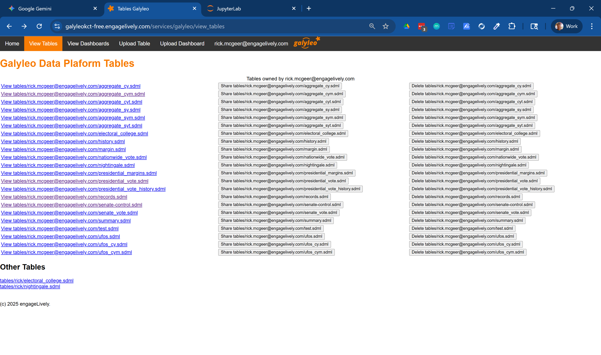
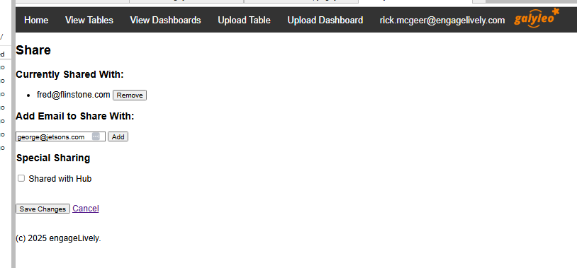
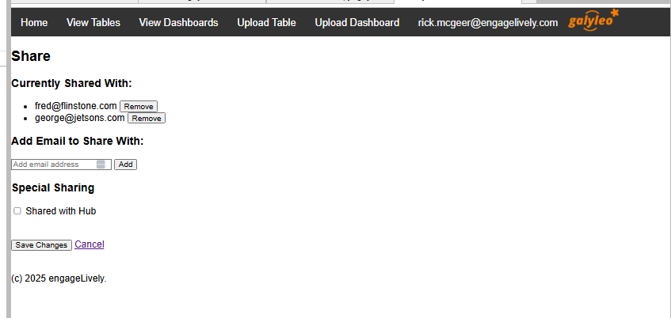
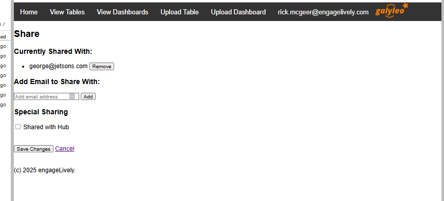

## How Items are Accessed, Shared,  and Published
This section describes how items (dashboards and tables) are accessed, published, and shared on the Galyleo service.

### Item URL
Every item stored on the Galyleo Service has an URL: `<hub-url>/services/galyleo/<item-kind>/<owner>/<item-name>`, where:

- hub-url is the URL of the Hub (e.g., https://galyleo-beta.engagelively.com)
- item-kind is the type of the item (either 'table' or 'dashboard')
- owner is the Hub _userid_  of the owner. For almost all deployments, this will be an email address.
- item-name is the name of the item, e.g., for the table nightingale.sdml, the name is nightingale.sdml.  _All dashboard names end in .gd.json and all table names end in .sdml_.

### Accessing  Items 
Users can access items that they own or that have been shared with them, either directly by name or as part of a group with which the item is shared.  The two existing groups are `HUB` (all users of the Hub) and `PUBLIC` (everyone).  On the WebUI, items which are accessible but not owned by the user are available at the bottom of the appropriate page, under "Other Dashboards" and "Other Tables".



### Sharing Items

By default, when an item is uploaded to the service either through the manual upload  or through the API methods `publish` and `publish_data`, the item is private to the item's owner.  It can be explicitly shared with other users either through the Web UI or through an API call.

#### Sharing Through the Web UI
Clicking the `Share` Button beside an item brings up a share screen: 



Entering a user's email and hitting 'Add' shares the table with that user.



Clicking the "Remove" button beside a user's name stops sharing the table with that user



`Save Changes` updates the share list; clicking `Cancel` leaves the share list unchanged.

#### Sharing  Through the API
An item is shared in the API at the time it is published, either through the `publish` method for dashboards or the `publish_data` method for tables.  An optional parameter to the body payload, `share_list`, is the list of users with whom the item should be shared.  Consider the example:
```
with open 'nighingale.sdml' as f:
  table = json.load(f)
  body = {
    'name': 'nightingale.sdml',
    'table': table,
    'share-list': ['foo@bar.com', 'fred@fake-domain.com']
  }
  url = 'https://galyleo-beta.engagelively.com/services/galyleo/publish_data'
  headers = {'Authorization': f'token {os.environ["JUPYTERHUB_API_TOKEN"]}'}
  response = requests.post(url, headers=headers, json=body)
```
This will publish the nightingale.sdml table and share it with users foo@bar.com, fred@fake-domain.com.

#### A Note on Sharing
Sharing a document such as a table or dashboard does _not_ automatically share embedded content.  So if a dashboard references the table nightingale.sdml, _the table must be separately shared with everyone who has access to the dashboard_.

#### The HUB User
The HUB user is a distinguished user which corresponds to all users of the Hub. Sharing with the HUB is the way that items are published to all Hub users.

