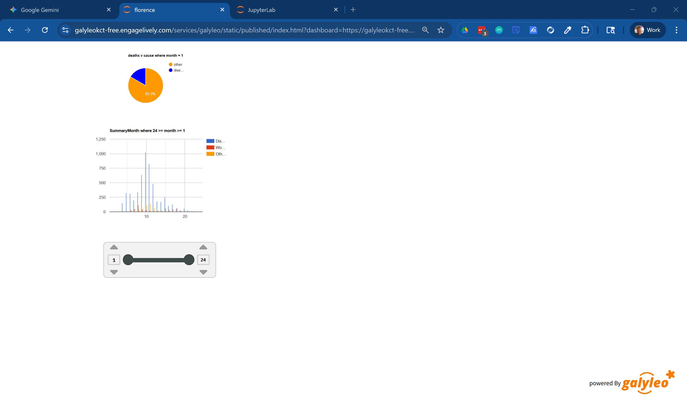
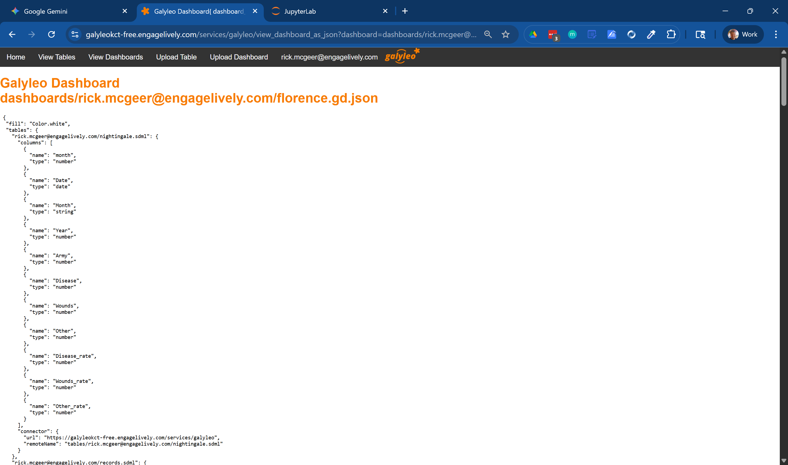
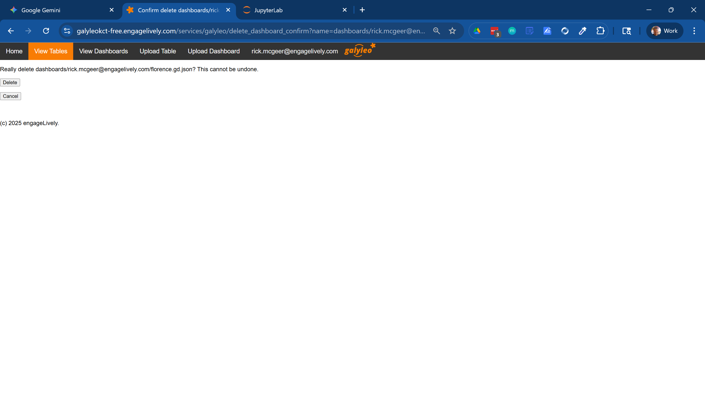
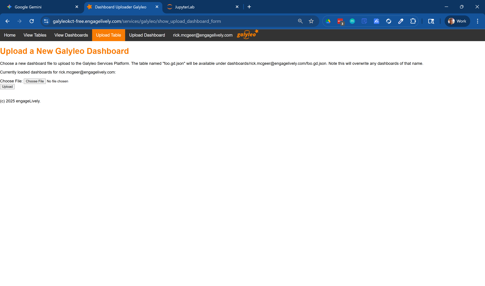
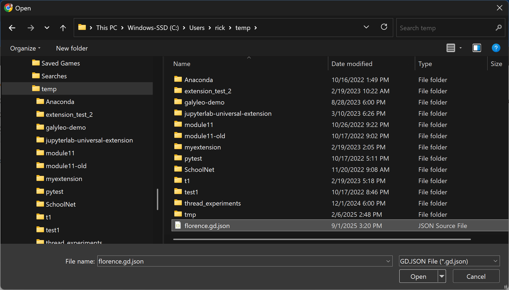
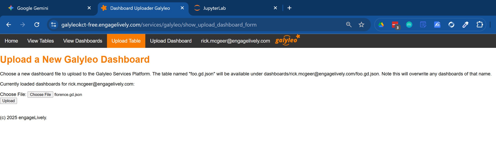
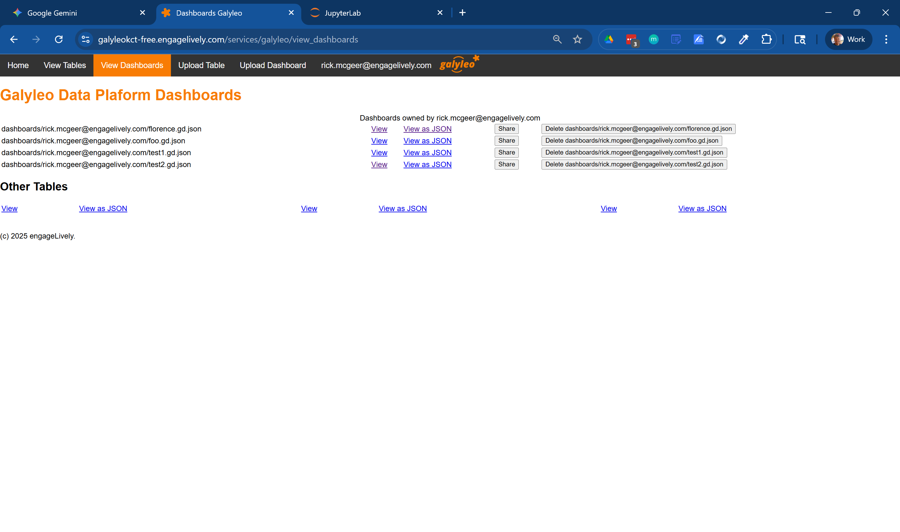

**View Dashboard**
Clicking on the link for an individual dashboard will display the dashboard.

**View as JSON**
Clicking  on the View As JSON button brings up the dashboard as a JSON file.

**Delete Dashboard**
Clicking on the Delete Dashboard button will delete the corresponding dashboard, after bringing up a confirmation screen.

### Upload Dashboards
Dashboards can be uploaded from the local disk by clicking on the Upload Dashboard tab.

Clicking on "Choose File" will bring up a native  file dialog, looking for `.gd.json` files.

After choosing a file, the file is designated on the upload page.

Clicking on the upload button uploads the dashboard and shows it on the View Dashboards page (the user will be redirected automatically).

### Upload Tables
Uploading tables is identical to uploading dashboards except that .sdml files are selected.