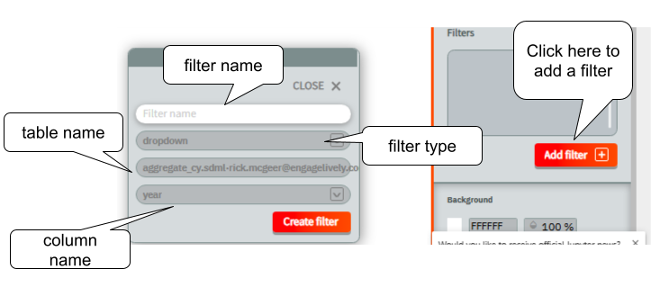
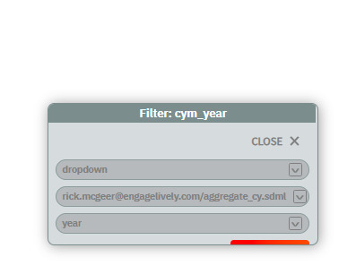

## Adding a Filter

Once tables are in the dashboard, filters can be created and edited.  This is done in the Filters tab, found by clicking filters.  Once again, there is an Add button below the lower-right corner of the filter list.  Click this, and a popup is brought up, permitting the user to create a filter.

The filter must have a name, which cannot be the name of another filter or chart.  Type this in the input box, and select a widget type from the upper drop-down and a column name from the lower drop-down, then click "Create". Clicking "Close" closes the dialog without creating a new filter.

Once the filter is created, it appears in the top-left corner of the dashboard.  The Filter is a physical object, and can be manipulated as with any other physical object on the dashboard, using the Halo and Sidebar as described above.  Put the dashboard into selection mode and move the filter as desired.

Clicking on the gear icon beside the name of an existing filter brings up a filter editor, as shown here.  The filter editor is very similar to the filter creator; it simply lacks an input for the filter name.  Choose column and widget, then Apply Changes to update the filter, or Close to close without update.  

Notice the pen icon is at the top right; once again, it is used to switch between inspection and edit modes, and filters are deleted in edit mode just as tables are, and with the same icon.

