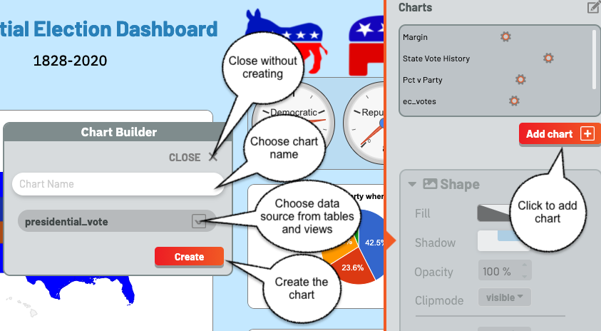
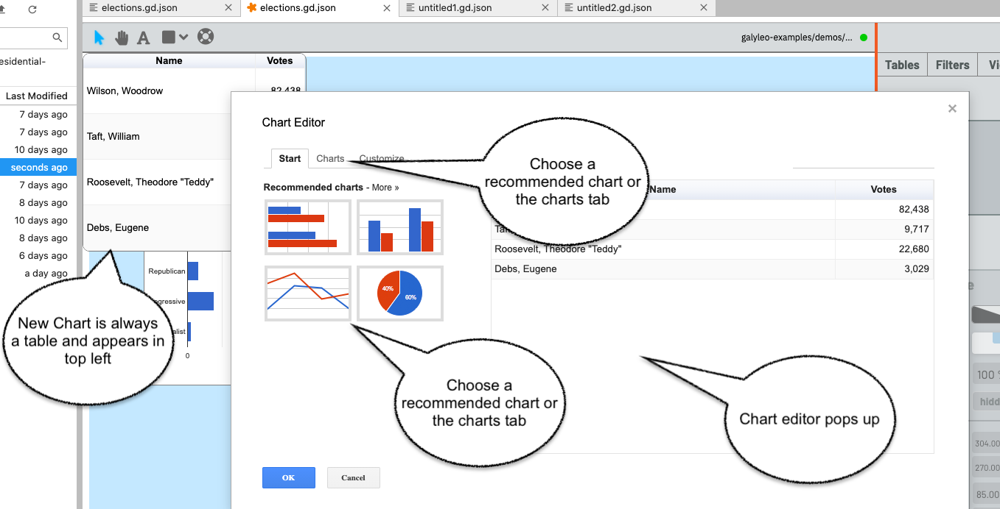
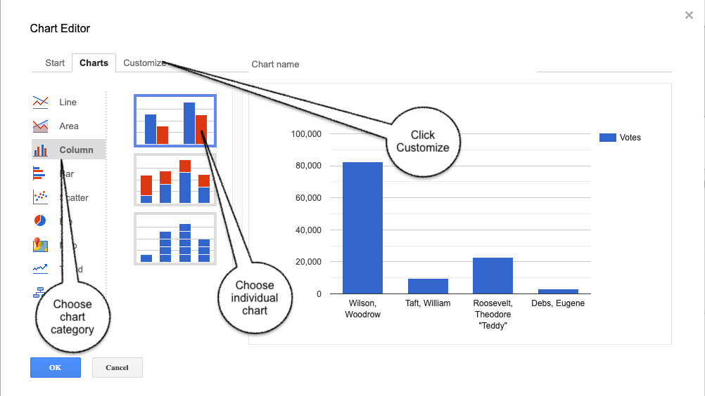
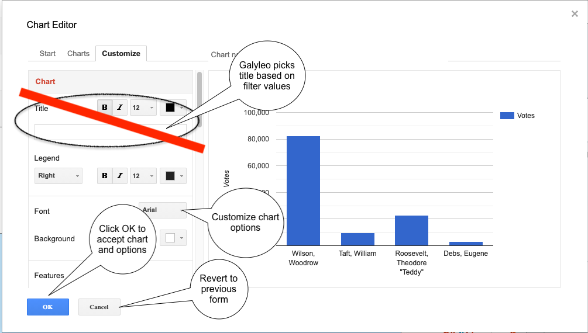
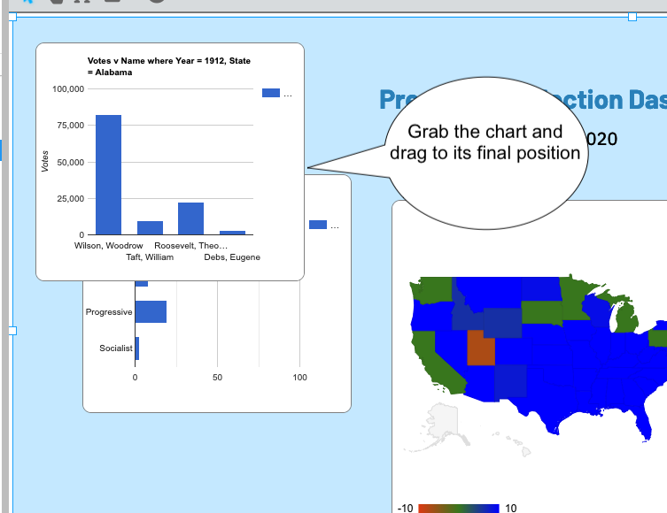
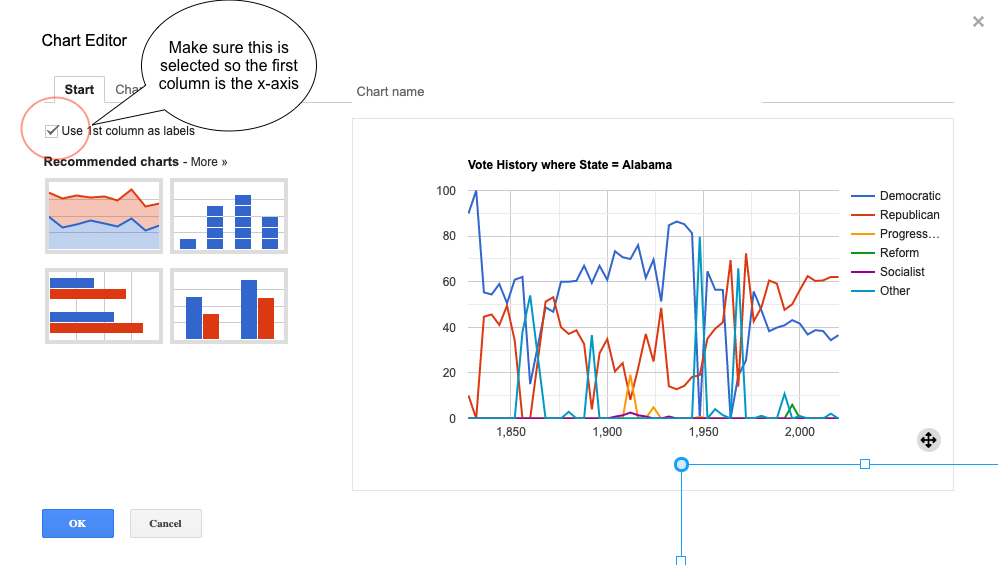

## Creating a Chart

Creating a Chart is very similar to creating a View, under the Charts tab.  Once again, there is an Add button below the lower-right corner of the chart list.  Click this, and a popup is brought up, permitting the user to create a chart.

The chart must have a name, which cannot be the name of another chart or filter.  Type this in the input box, and choose the view or table to use as a data source from the  drop-down, then click "Create". Clicking "Close" closes the dialog without creating a new chart.
s
An error will display if a name is not entered, or if the name of another filter or chart is chosen.

Once a chart is created, it is immediately added to the chart list, the chart is brought up as a table on the dashboard, and the Chart Editor pops up.

The Chart Editor is also brought up by clicking on the gear icon beside the name of a Chart.  

Once the Chart Editor pops up (it is the standard Google Chart Editor), choose the chart type either from the recommended charts on the start page, or click the Charts tab and then choose the chart type on the charts page.

Then click customize and choose chart options.  We recommend that you *not* choose a title for the chart; Galyleo automatically generates a title based on the names of the columns chosen and the values of the filters used to drive the chart.

Once you're happy with the chart, click OK.

*Important note*.  When choosing Line or Area Charts, using the first column as X-axis labels (rather than a data series) must be explicitly chosen by checking "Use 1st Column as Labels" on the Start tab in the editor.

As with tables, filters, and views, charts can be deleted using the pen icon above the chart list to switch to edit mode, then deleting charts in the same way tables, filters and views are deleted. 
