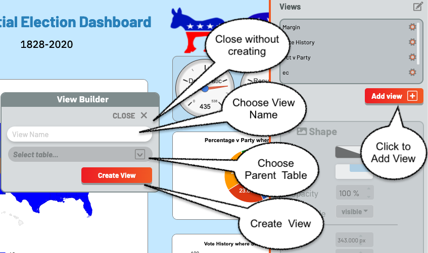
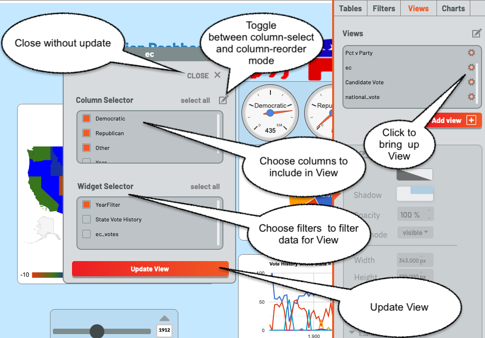
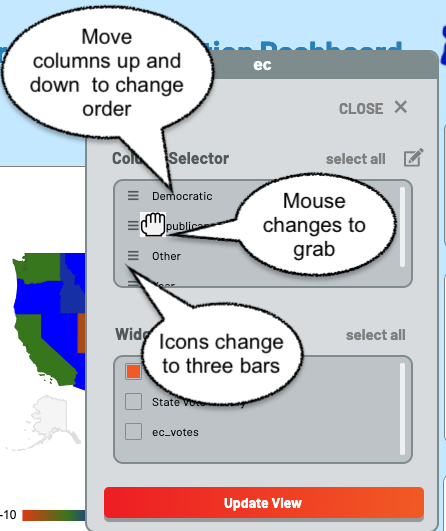

## Creating a View

Creating a View is very similar to creating a Filter, under the Views Tab.  Once again, there is an Add button below the lower-right corner of the views list.  Click this, and a popup is brought up, permitting the user to create a view.

The view must have a name, which cannot be the name of another view or table.  Type this in the input box, and choose the underlying table from the  drop-down, then click create. Clicking "Close" closes the dialog without creating a new view.

An error will display if a name is not entered, or if the name of another view or table is chosen.

Once a View is created, it is immediately added to the View List, and a View editor is brought up.

The View Editor is also brought up by clicking on the gear icon beside the name of a View.  It consists of two panels, a Column Chooser and a Filter Chooser.  The Column Chooser chooses the columns for the View, and the Filter Chooser chooses the filters which will be applied to the underlying table to get the rows for the View.  

Since column order is important for a View, there is a column-order mode.  It is toggled by choosing the pen icon above the Columns list.  When it is toggled, the icons beside the column names change to three horizontal bars and the mouse changes to a grab icon.  The columns can then be dragged into order with the mouse.  Note that while all columns are displayed, only the order of selected columns are important.

As with tables and filters, views can be deleted using the pen icon above the view list to switch to edit mode, then deleting views in the same way tables and filters are deleted.