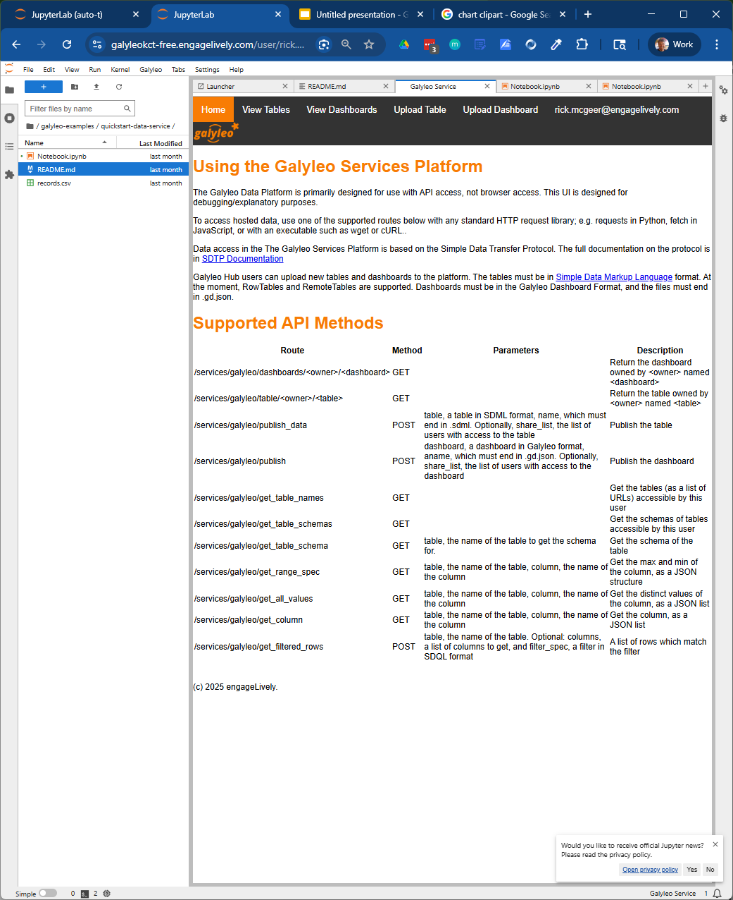

## Creating a Table
This begins with publishing a data table to the Galyleo service.  Construction of a table is done  using the Simple Data Markup Language (SDML), which is thoroughly documented at [Simple Data Transfer Protocol](https://global-data-plane.github.io/sdtp).

The common case to start is with a `RowTable`.  A `RowTable` is just an SDML Table with the rows explicitly represented in the table.  We start with the table from the last section:

name | mfr | type | calories | fiber | rating |
-----|-----|-----|-----|-----|-----|
100% Bran | N | C | 70 | 10 | 68.402973 |
100% Natural Bran | Q | C | 120 | 2 | 33.983679 |
All-Bran | K | C | 70 | 9 | 59.425505 |
All-Bran with Extra Fiber | K | C | 50 | 14 | 93.704912 |
Almond Delight | R | C | 110 | 1 | 34.384843 |
Apple Cinnamon Cheerios | G | C | 110 | 1.5 | 29.509541 |
Apple Jacks | K | C | 110 | 1 | 33.174094 |
Basic 4 | G | C | 130 | 2 | 37.038562 |
Bran Chex | R | C | 90 | 4 | 49.120253 |
Bran Flakes | P | C | 90 | 5 | 53.313813 |
Cap'n'Crunch | Q | C | 120 | 0 | 18.042851 |
Cheerios | G | C | 110 | 2 | 50.764999 |
Cream of Wheat (Quick) | N | H | 100 | 1 | 64.533816 |
Maypo | A | H | 100 | 0 | 54.850917 |

The table starts with a schema, which gives the names and data types of each column:

```
   [
       {"name": "name", "type": "string"},
       {"name": "mfr", "type": "string"},
       {"name": "type", "type": "string"},
       {"name": "calories", "type": "number"},
       {"name": "fiber", "type": "number"},
       {"name": "rating", "type": "number"}
   ]
```

The rows are then explicitly represented in JSON:
```
  [
   {"100% Bran", "N ", "C",  70, 10, 68.402973},
   {"100% Natural Bran", "Q ", "C",  120, 2, 33.983679},
   {"All-Bran", "K ", "C",  70, 9, 59.425505},
   {"All-Bran with Extra Fiber", "K ", "C",  50, 14, 93.704912},
   {"Almond Delight", "R ", "C",  110, 1, 34.384843},
   {"Apple Cinnamon Cheerios", "G ", "C",  110, 1.5, 29.509541},
   {"Apple Jacks", "K ", "C",  110, 1, 33.174094},
   {"Basic 4", "G ", "C",  130, 2, 37.038562},
   {"Bran Chex", "R ", "C",  90, 4, 49.120253},
   {"Bran Flakes", "P ", "C",  90, 5, 53.313813},
   {"Cap'n'Crunch", "Q ", "C",  120, 0, 18.042851},
   {"Cheerios", "G ", "C",  110, 2, 50.764999},
   {"Cream of Wheat (Quick)", "N ", "H",  100, 1, 64.533816},
   {"Maypo", "A ", "H",  100, 0, 54.850917}
  ]

```
The markup form of the table is then, in JSON:
```
{
  "type": "RowTable",
  "schema": [
    {"name": "name", "type": "string"},
    {"name": "mfr", "type": "string"},
    {"name": "type", "type": "string"},
    {"name": "calories", "type": "number"},
    {"name": "fiber", "type": "number"},
    {"name": "rating", "type": "number"}
  ],
  "rows": [
   {"100% Bran", "N ", "C",  70, 10, 68.402973},
   {"100% Natural Bran", "Q ", "C",  120, 2, 33.983679},
   {"All-Bran", "K ", "C",  70, 9, 59.425505},
   {"All-Bran with Extra Fiber", "K ", "C",  50, 14, 93.704912},
   {"Almond Delight", "R ", "C",  110, 1, 34.384843},
   {"Apple Cinnamon Cheerios", "G ", "C",  110, 1.5, 29.509541},
   {"Apple Jacks", "K ", "C",  110, 1, 33.174094},
   {"Basic 4", "G ", "C",  130, 2, 37.038562},
   {"Bran Chex", "R ", "C",  90, 4, 49.120253},
   {"Bran Flakes", "P ", "C",  90, 5, 53.313813},
   {"Cap'n'Crunch", "Q ", "C",  120, 0, 18.042851},
   {"Cheerios", "G ", "C",  110, 2, 50.764999},
   {"Cream of Wheat (Quick)", "N ", "H",  100, 1, 64.533816},
   {"Maypo", "A ", "H",  100, 0, 54.850917}
  ]
}
```

Tables can be created through the SDTP library, included with every Galyleo shipment, or by assembling the components and saving them as an SDML file to disk.

## Publishing a Table
A table can be published either through the Galyleo Service Web UI or using the Galyleo Service REST API.

### Using the Galyleo Service Web UI
Click on the Galyleo menu on Jupyter Lab.  This will bring up the Galyleo Services tab:



Click on Upload Table.  This will bring up a table uploader:

![Galyleo Upload] (images/upload.png)

Choose a file and then click Upload.  You will be returned to the Table Viewer in the service, where you will see your uploaded table:


### Using the API
The Galyleo Service method `publish_data` accepts an SDML table in JSON form.  In order to use it, create the table using the SDTP library and then get its JSON form:
```
schema = [
  {"name": "name", "type": "string"},
  {"name": "mfr", "type": "string"},
  {"name": "type", "type": "string"},
  {"name": "calories", "type": "number"},
  {"name": "fiber", "type": "number"},
  {"name": "rating", "type": "number"}
]
rows = [
{"100% Bran", "N ", "C",  70, 10, 68.402973},
   {"100% Natural Bran", "Q ", "C",  120, 2, 33.983679},
   {"All-Bran", "K ", "C",  70, 9, 59.425505},
   {"All-Bran with Extra Fiber", "K ", "C",  50, 14, 93.704912},
   {"Almond Delight", "R ", "C",  110, 1, 34.384843},
   {"Apple Cinnamon Cheerios", "G ", "C",  110, 1.5, 29.509541},
   {"Apple Jacks", "K ", "C",  110, 1, 33.174094},
   {"Basic 4", "G ", "C",  130, 2, 37.038562},
   {"Bran Chex", "R ", "C",  90, 4, 49.120253},
   {"Bran Flakes", "P ", "C",  90, 5, 53.313813},
   {"Cap'n'Crunch", "Q ", "C",  120, 0, 18.042851},
   {"Cheerios", "G ", "C",  110, 2, 50.764999},
   {"Cream of Wheat (Quick)", "N ", "H",  100, 1, 64.533816},
   {"Maypo", "A ", "H",  100, 0, 54.850917}
]
from sdtp import RowTable
table = RowTable(schema, rows)
table_as_json = table.to_json()
```

We can then publish the table as follows:
```
import sdtp
import os
import requests
HUB_URL = "https://galyleo.engagelively.com"
publish_url = f'{HUB_URL}/services/galyleo/publish_data'
user_token = os.environ["JUPYTERHUB_API_TOKEN"] # Automatically issued to every user
headers = {"Authorization": f"token {user_token}"}
payload = {"name": "cereal.sdml", "table": table_as_json}
response = requests.post(publish_url, headers=headers, payload=payload)
```
And the table will appear in the list of published tables.