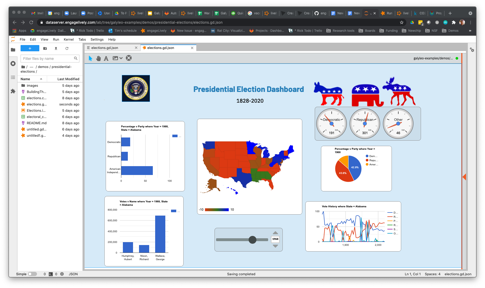

.. image :: images/galyleo-logo.png
   :width: 100

###############
GETTING STARTED
###############

Overview
========

Galyleo is a package  for the  drag-and-drop  design and publication of  interactive dashboards driven by Jupyter Notebooks.  It is available as an extension to JupyterLab, and is also available for other Jupyter enviroments or other programs.  A similar dashboard can be found here: `elections <https://editor.engagelively.com/lively.freezer/frozenParts/rick/US_Presidential_Election/index.html>`_.

This dashboard is designed entirely in Galyleo:

Galyleo was designed to fit  seamlessly into  the Jupyter workflow.  A Galyleo document is stored on the Jupyter Hub’s storage system, and the Galyleo Editor is simply another tab in a standard JupyterLab environment.  In other words, it is  simply another tool in JupyterLab to complement the Notebook environment.  

Galileo, of course, was the inventor of the telescope and the person who first say Jupiter’s moons; we are a visualization solution and we hope that our users will use our technology to make profound discoveries.

Tutorials and Demos
-------------------

A number of tutorial and example projects can be found at: `Galyleo Examples <https://github.com/engageLively/galyleo-examples>`_.

Reporting an issue
-------------------
Please use the bug-reporting button on the Galyleo toolbar to report an issue to us, or write galyleo_support@engagelively.com

Frequently Asked Questions
---------------------------
1. Is Galyleo free and open-source?
   
*Yes*.  Galyleo is released under a BSD 3-clause license.

2. Can I use Galyleo with a Notebook using an R, Julia, or  other kernel, or must I use Python?

The connection between the dashboard and the kernel is given by the Galyleo client, which is currently a Python module.  So if the kernel can use Python modules, it can be used today.  The Galyleo module is very simple, so we expect to implement it in other languages.  Of course, it is also open-source, and the protocol is documented; so others are free to implement this as well.

3. Can I use other editors besides the Galyleo editor to edit my dashboard?

*Yes*.  The dashboard's disk and wire format is a JSON document, and the format is specified in the interchange format section.

4. What's the underlying technology for the editor?
   
The underlying technology  is lively.next, an MIT-licensed environment for developing browser-hosted graphical, interactive applications.  You can find its repo here: `Lively Next: <https://github.com/LivelyKernel/lively.next>`_

5. Can I publish my dashboards to the web, or on my local intranet?
   
We've developed, and are in beta, with  a web application which  takes the URL for a Galyleo Dashboard document as the  parameter dashboard and renders the document in the browser.  The page is at https://galyleobeta.engageLively.com/galyleo/index.html.  That page can be served from any convenient web server, on the web or on an intranet.    So publication is as easy as storing the dashboard file on any resource that has an URL (e.g., in a github repo, or for that matter Google Drive with the appropriate permissions).

Following that, on our roadmap is a feature which will drop a complete web page as a directory into your JupyterLab directory, and from there you can export it to any convenient web page.

6. What browsers are required to run Galyleo Studio?

We've tested it on Chrome, Firefox, Edge,  and Safari.  We believe that a keybnoard and mouse or touchpad are required to get the best use out of Galyleo Studio, so we recommend the use of a computer or netbook to build dashboards.  Dashboards can be viewed on any modern browser on any device.

