**************
User Guide
**************

Launching A Dashboard
=====================
A new Galyleo Dashboard can be launched from the JupyterLab launcher or from the File>New menu:

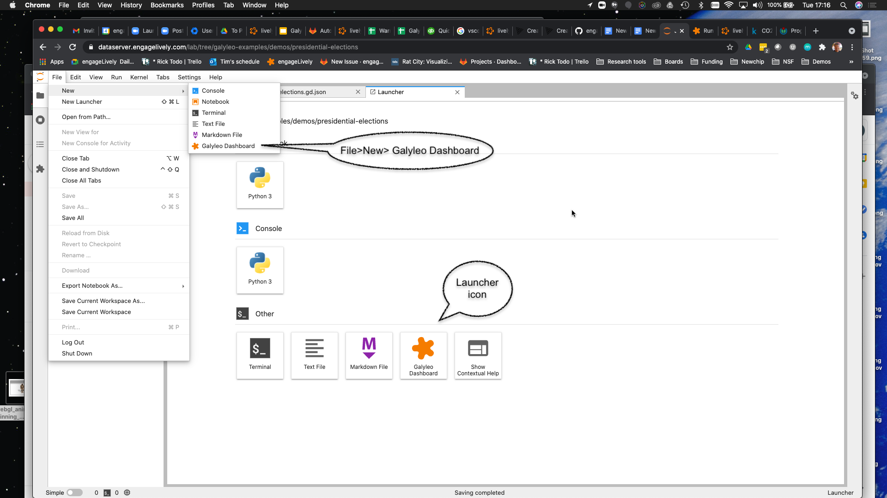

An existing dashboard is saved as a .gd.json file, and is denoted with the Galyleo star logo:

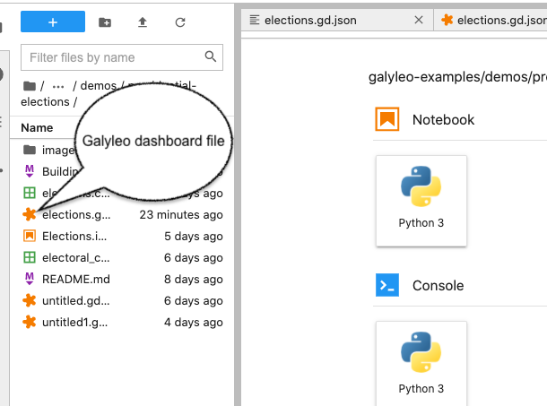

It can be opened in the usual way, with a double-click.

The Galyleo User Interface
==========================
The Galyleo User interface consists of three components: the top bar, the side bar, and the Halo and Context Menu.  We discuss each of these in turn.  The mission of the Top Bar is to switch between global modes (interacting and selecting) and added non-chart elements (shapes, images, and text) to the dashboard.  The Halo and Side Bar is where individual objects are positioned and configured: where shape and text properties are set, borders defined, and images chosen.  The  Halo   permits the copying, deletion, resizing, and rotation rotation,  of objects front-to-back.  The Context Menu, brought up by a right-click on the object, permits its reordering.

The Top Bar
-----------
The top bar controls are in the top left of the dashboard.  They are primarily used to choose between selection mode (when the user is designing the dashboard) and interaction mode (when the user is interacting with the dashboard, e.g, manipulating a slider).  The practical difference is that when the user is in interaction mode (the arrow is highlighted) a Halo appears over the clicked item and the sidebar is shown; when in interaction mode (the hand is selected) the object is manipulated on click.
When Text (the A) is selected, a user click brings up a text box.  When a shape is selected (one of Rectangle, Ellipse, Image, or Label) the appropriate shape is drawn in response to a user click.
The last item on the top bar is a lifesaver icon, which brings up a bug-report dialog.

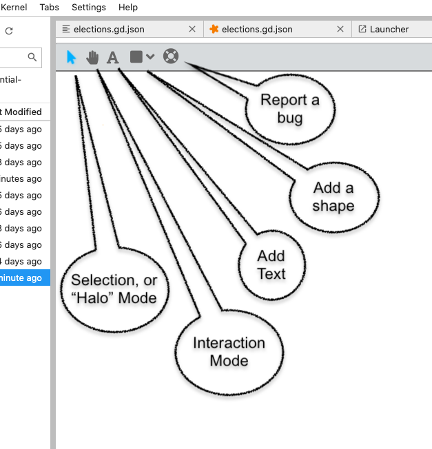

The Halo and the Side Bar
-------------------------
The Halo and the Side Bar are used to configure an object when it's created, and can also be used to configure physical properties of charts and filters.  The Halo automatically appears when an object is clicked on and Selection mode is enabled (the arrow icon in the top bar.  The side bar automatically appears when a shape or text is created, or when the knob in the middle of the sidebar is clicked.  

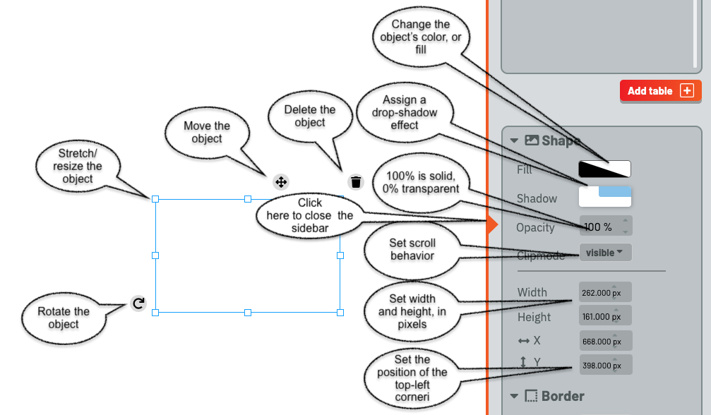

The Halo shows control points and tools around the selected object.  The eight control points in the inner halo are used to change the width and height of the object.  The tool in the bottom-left corner is used to rotate the object.  The cross on the top bar is used to move it.  The trash can on the bottom left is used to delete the object.

The Side bar consists of two parts.  The top one, which we'll return to later, manages Tables, Filters, Views, and Charts.  The bottom part is used to configure objects.  It has three sections, each activated by clicking on the chevron next to the name.

The *Shape* configurer is shown in the image, with its eight components shown.  They are used to configure the fill (color) and opacity of the object, as well as whether the object casts a drop shadow. 

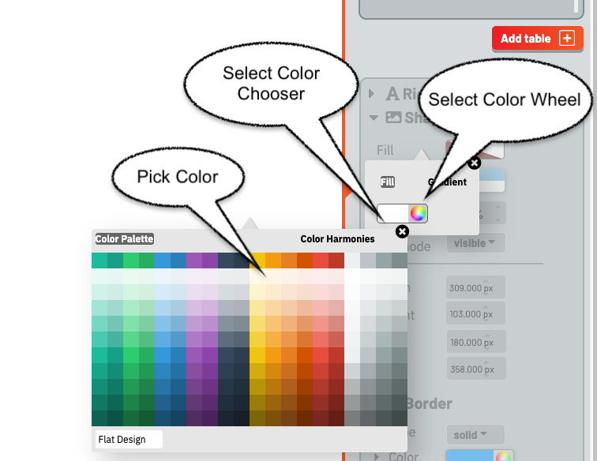

The Color Chooser offers two modes to choose the color of an object.  The first, found by clicking the left-hand rectangle, brings up a palette of colors to choose from.

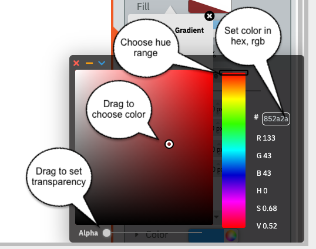

The second permits a fine-grained choice.  The Hue bar is used to set the area of the rainbow to pick a color from; dragging the dot in the left-hand square gives the user the ability to choose a specific color.  The slider at the bottom controls opacity/transparency of the color (as opposed  to the object itself).  Finally, the text box gives the user the ability to specify an RGB color, entered as six hex digits.

The "Clipmode" menu gives the user the ability to control what happens when the object is too big for its bounding box.  The choices are "visible" (overflows), "hidden" (cut off), "scroll" (scrollbars appear at the right and/or bottom of the object, and "auto" -- the system chooses.

The position is the x,y coordinate of the top-left corner of the object, where (0,0) is the top-left corner of the dashboard; x increases left-to-right, and y top-to-bottom.

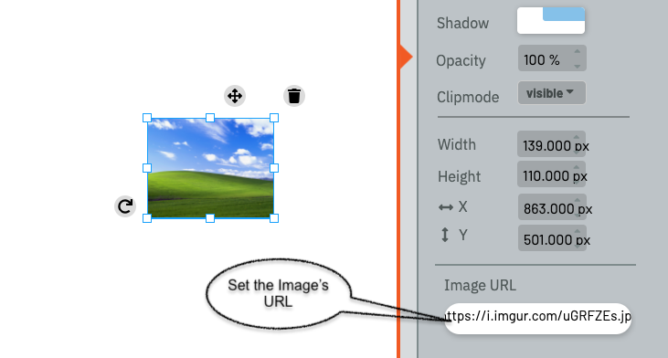

When an image is selected, a dialog appears at the bottom of the Shape configurer, permitting the user to choose the URL for the image.  

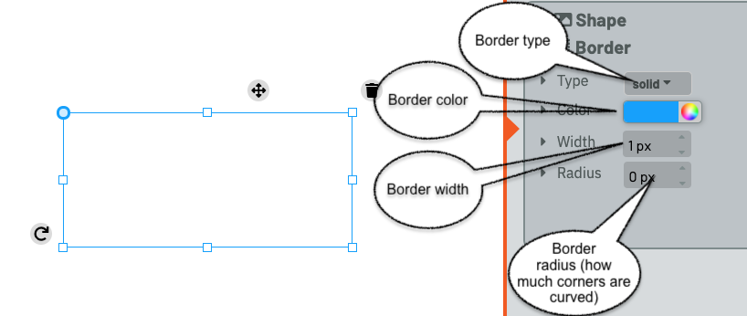

The *Borders* configurer, below  the shape configurer, offers the user the ability to control the color, width, and radius of corners, and the type of line that forms the borders (solid, dotted, dashed, ridged, double, groove, or inset). Hidden and none, two other border options, are equivalent to no border.

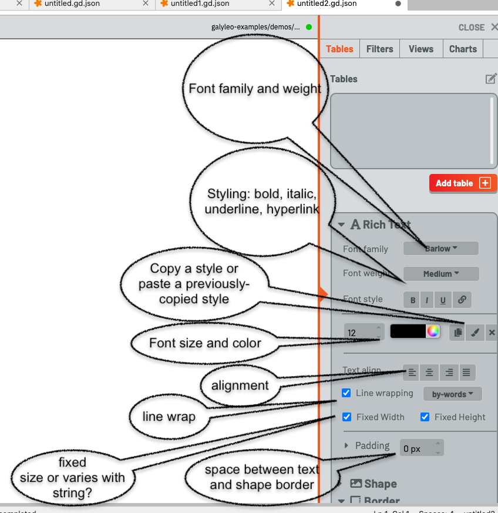

The *Text* controller only appears when a Text item is selected, and it is used to control the textual properties of a text object.  These are:

- The font family and weigt (fine to extra-bold)
- The font style (bold, italic, underline, hyperlink)
- The font size and color
- Alignment
- Whether and how lines are wrapped (by words, anywhere, only by words (cannot break a word, or by characters)
- Whether the text box size is set by the user or grows and shrinks with the storing
- The padding control gives the spacing between the text boundary and the boundary of the object, in pixels

There are also three buttons, next to the color chooser, which permit a user to copy style (the standard copy icon), paste a copied style (the paste brush), or clear all formatting (the x).

The Context Menu 
-----------------------------

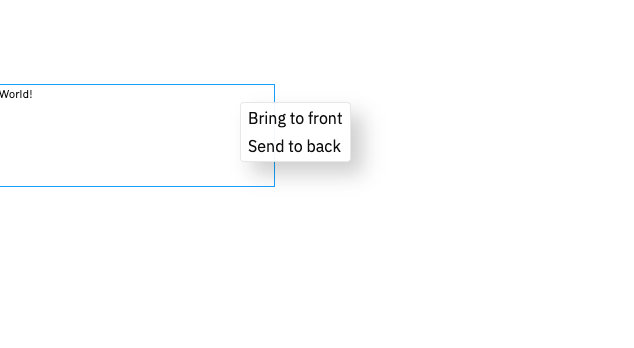

The context menu appears when the object is right-clicked and selection mode is enabled.  It controls the ordering of objects, front-to-back.

Galyleo Data Architecture And Flow
===================================
The data flow in Galyleo is shown here.  Data is produced in a Jupyter Notebook, and then sent to a dashboard via the Galyleo library.  The object sent to a dashboard is a Table, which is conceptually a SQL database table -- a list of columns, each with a type, and a list of list of rows, which form the Table's data.  The data is then optionally passed through *filters*.  A *Filter* is a user interface element that selects a value (or range of values) from a column.  This can be used to choose subsets of rows from a particular table, to create what we call a *View*.  

A *View* is a subset of a table; a selection (and, potentially, a reordering) of the columns of a table, and a subset of its rows, chosen by one or more Filters.  Static  charts can take as input *Table*; these charts display the same data, independent of user actions.  Dynamic charts take as input a View, which shows the data as filtered by the user  through user inputs.   

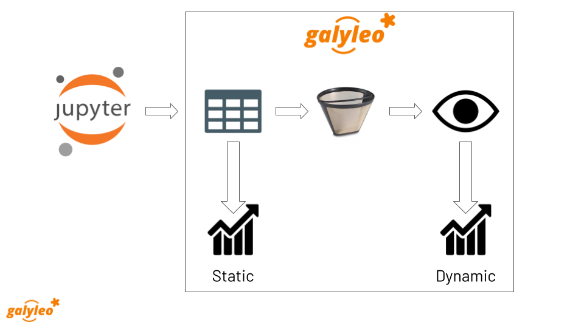

Tables
------
A Table is equivalent to  a SQL database table -- a list of columns, each with a type, and a list of list of rows, which form the Table's *data*.*  A table has a name, which must be unique among tables and views, a source, a schema, and data.
A *schema* is a list of records of the form ``{"name": <name>, "type": <type>}``, where <name> is the column name and type is the column type, which is chosen from the set ``{"number", "string", "boolean", "date", "datetime", "timeofday"}``.  These are captured in the ``galyleoconstants`` library ``GALYLEO_STRING, GALYLEO_NUMBER, GALYLEO_BOOLEAN, GALYLEO_DATE, GALYLEO_DATETIME, GALYLEO_TIME_OF_DAY``.

The Table data is a list of lists, where each list is a row of  the table.  Each row must meet two conditions:

- The entry in column *i* must be of the type of schema entry *i*
- It must have the same length as the schema
  
Tables are formed using the ``GalyleoTable`` class in the ``galyleo_table`` Python module.

Here's a simple example of a Table, which we'll use throughout this tutorial:

.. csv-table:: Cereal Example
   :file: cereal.csv
   :header-rows: 1

This is a formatted version of the table.  The schema is:
::

   [
       {"name": "name", "type": GALYLEO_STRING},
       {"name": "mfr", "type": GALYLEO_STRING},
       {"name": "type", "type": GALYLEO_STRING},
       {"name": "calories", "type": GALYLEO_NUMBER},
       {"name": "fiber", "type": GALYLEO_NUMBER},
       {"name": "rating", "type": GALYLEO_NUMBER}
   ]

And the first data row is:
::

   ["100% Bran","N","C",70,10,68.402973]

Filters
-------
A Filter is a user-interface element that selects rows from tables, based on values from an individual, named column.  A *Select* Filter chooses rows whose value in the named column is equal to the filter's value.  For example, a Select Filter over the type column in our example whose value is "H" would select rows:

+-----------------------+------+------+----------+-------+-----------+
| name                  | mfr  | type | calories | fiber | rating    |
+=======================+======+======+==========+=======+===========+
| Cream of Wheat (Quick)| N    | H    | 100      | 1     | 64.533816 |
+-----------------------+------+------+----------+-------+-----------+
| Maypo                 | A    | H    | 100      | 0     | 54.850917 |
+-----------------------+------+------+----------+-------+-----------+

A *Range* filter chooses rows whose value lies between the two values of the filter.  For example, a Range Filter over the calories column whose minimum is 50 and whose maximum is 70 would select the  rows 

+--------------------------+-----+------+----------+-------+-----------+
| name                     | mfr | type | calories | fiber | rating    |
+==========================+=====+======+==========+=======+===========+
| 100% Bran                | N   | C    | 70       | 10    | 68.402973 |
+--------------------------+-----+------+----------+-------+-----------+
| All-Bran                 | K   | C    | 70       | 9     | 59.425505 |
+--------------------------+-----+------+----------+-------+-----------+
| All-Bran with Extra Fiber| K   | C    | 50       | 14    | 93.704912 |
+--------------------------+-----+------+----------+-------+-----------+

*Range* and *Select* specify the functional properties of filters (whether the filter selects a specific value or all values in a range).  The physical properties of a filter are dependent  on the functional properties of the filter, the data type of the column, and user experience factors.  For example, a spinner and a slider are both Select filters over numeric columns, but are very different widgets.  At this writing, the *current* set of supported filters are:

+---------------+-------------+-------------+
| Filter        | Filter Type | Column Type |
+===============+=============+=============+
| List          | Select      | any         |
+---------------+-------------+-------------+
| Dropdown      | Select      | any         |
+---------------+-------------+-------------+
| Spinner       | Select      | Number      |
+---------------+-------------+-------------+
| Slider        | Select      | Number      |
+---------------+-------------+-------------+
| Min/Max       | Range       | Number      |
+---------------+-------------+-------------+
| Double Slider | Range       | Number      |
+---------------+-------------+-------------+
| Toggle        | Select      | Boolean     |
+---------------+-------------+-------------+

Views
-----
A _View_ is a subset of a table; a selection (and, potentially, a reordering) of the columns of a table, and a subset of its rows, chosen by one or more Filters.  While a chart can take as input a _Table_, such a chart wouldn't respond to user inputs (because a user selects the rows he's interested in by adjusting a Filter, and filters only affect the rows in Views).  
A View is chosen with:
- a source table;
- a fixed subset (and potential reordering) of columns
- a set of filters which select the rows of the table.  The filters are considered to have acted in sequence, and thus the rows preserved are the logical AND of the applied filters.
For example, suppose we wanted to construct a View with columns name, rating from our table, and had a range filter on column calories and a select filter on column mfr.  The View would be:
::

  {
    "table": "cereal",
    "columns": ["name", "rating"],
    "filters": ["mfrFilter", "calorieFilter"]
  }

And, if mfrFilter was set to "N" (Nabisco) and calorieFilter to [50, 90], the data in the view would be:

+----------+----------+
| name     | rating   |
+==========+==========+
| 100% Bran| 68.402973|
+----------+----------+

Charts
------
Charts are, well, charts.  Each chart takes its input data from a View or a Table.  The category, or X axis (place on geocharts, X axis on column charts or line charts, Y axis on bar charts, wedge labels on donut or pie charts) is the first column in the view or table.  This is why an important part of constructing a view is reoordering columns.
The current set of Chart types supported by Galyleo are Google Charts; however, we intend to extend these chart types in the near future, to include OpenLayers, Leaflet.js, Chart.js, Cytoscape.js, and others.   It is the intent of the Galyleo system that *any* JavaScript/HTML5-hosted charts be available under Galyleo.

Charts as Filters
-----------------
One common operation in Dashboards is to use Charts as filters.  This enables drill-down and detail operations on particular categories.  Consider, for example, a table that gives average rating by manufacturer on the cereals example, where the data is shown on the dashboard as a column chart.  What we'd like is to see the detailed rating, by cereal brand, on another chart, filtered by manufacturer, and when the user clicks on the bar for a particular manufacturer on the average-rating chart the detail for that manufacturer is shown on the detail-rating chart.
Or consider the Presidential Election database example; when we click on a state, we see the vote for that state for the chosen year and the voting history for that state.
In both these cases, the chart is being used as a filter; it selects the manufacturer for the rating-detail chart and the state in the vote-history and vote-detail charts.
This is such a common use case that it is made a feature in Galyleo: every chart is a filter.  Specifically, it is a select filter on the category column of the View or Table that is input to the chart.  As we'll see below, charts show up in the same UI sections as filters.

Names and Namespaces
--------------------
References are by name in Galyleo; each object (Table, Filter, View, or Chart)  has a name.  Since a Chart can take input from a View or a Table, Views and Tables share the same namespace (Data Source) and a Table cannot have the same name as a View.  Similarly, since every Chart is also a Filter, Charts and Filters share the same namespace (Data Selectors), and a Chart cannot have the same name as a Filter or another Chart.  
Objects in different namespaces can share a name.  For example, it's quite common for a View and a Chart to share a name, when the View is the data source for the Chart and isn't otherwise used.

+---------------+-----------------+
| Namespace     | Objects         |
+===============+=================+
| Data Source   | Tables, Views   |
+---------------+-----------------+
| Data Selector | Charts, Filters |
+---------------+-----------------+

Using Galyleo
=============
This section covers the library and user interface elements for sending Tables from Jupyter Notebooks to Galyleo Dashboards, and using the Galyleo UI to add Filters, Views, Charts, and explanatory elements (Text, Shapes, and Images) to the Dashboard.  The UI for Shapes, Images, and Text was largely covered above, so we'll focus on tables, filters, views, and charts here.

The Galyleo UI
--------------
Key elements of the Galyleo UI can be seen in the Tables section of the sidebar, shown here with annotations.

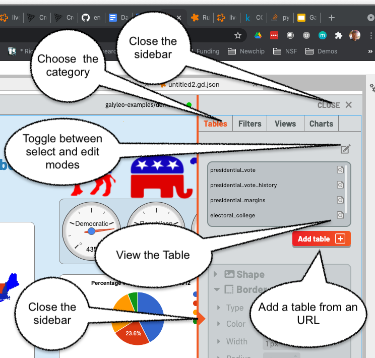

The tab selectors choose the category of item being viewed.  Here, it is the list of Tables (the Tables tab is highlighted in orange).  To the right of each Table name is an inspection icon. Clicking on this gives a preview of the selected table in a popup window.  *Warning:* this should be done carefully, since viewing large tables can cause performance issues.  Clicking on the "Add Table" button brings up a popup, inviting a load of a Table in intermediate form from an URL. 

The sidebar is closed either by clicking on the orange triangle in the center of the sidebar's left edge, or on the close button on the top right.

Clicking on the pen icon on the top right of the Table list toggles between inspection mode and edit mode.

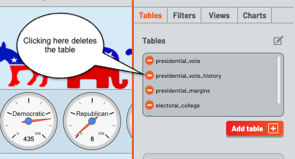

When in edit mode, clicking on the circle to the  left of a table name deletes the circle.  Clicking on the pen icon again restores inspection mode.

Every element of the Table UI is present for all classes of element, (Tables, Filters, Views, and Charts).  The pen is present in all lists to switch between inspection/configuration mode for all classes, each class has an Add button, and the close-sidebar buttons are always present.

Sending Tables to the Dashboard
--------------------------------
The anticipated method of loading a table is to send it from a Notebook.  The Galyleo Client document has a detailed description of how to do that.  The brief version is to collect the data in a tabular forma, either a list of lists or a Pandas dataframe, create a ``GalyleoTable`` from the ``galyleo.galyleo_table`` module, load the data into it, create a ``GalyleoClient`` from the ``galyleo.galyleo_client`` module, and then use the ``client.send_data_to_dashboard()`` method to send the data.

``send_data_to_dashboard`` sends data to *open* dashboards in the JupyterLab editor.  Data can be sent to a *specific* dashboard by naming it in the call to ``send_data_to_dashboard``.  Here is a short snippet which sends the cereals data we've used above to a dashboard, assuming the file is in ``cereals.csv``:

::

  from galyleo.galyleo_client import GalyleoClient
  from galyleo.galyleo_table import GalyleoTable
  from galyleo.galyleoconstants import GALYLEO_STRING, GALYLEO_NUMBER
  import csv
  f = open('cereals.csv', 'r')
  reader = csv.csv_reader(f)
  data = [row for row in reader][:1]
  table = GalyleoTable('cereals')
  schema = [("name", GALYLEO_STRING), ("mfr",  GALYLEO_STRING), ("type",  GALYLEO_STRING), ("calories",  GALYLEO_NUMBER), ("fiber,  GALYLEO_NUMBER), ("rating",  GALYLEO_NUMBER)]
  table.load_from_schema_and_data(schema, data)
  client = GalyleoClient()
  client.send_data_to_dashboard(table)

Other methods of loading data and schemas can be found in the documentation for the GalyleoTable class.

Adding a Filter
---------------

Once tables are in the dashboard, filters can be created and edited.  This is done in the Filters tab, found by clicking filters.  Once again, there is an Add button below the lower-right corner of the filter list.  Click this, and a popup is brought up, permitting the user to create a filter.

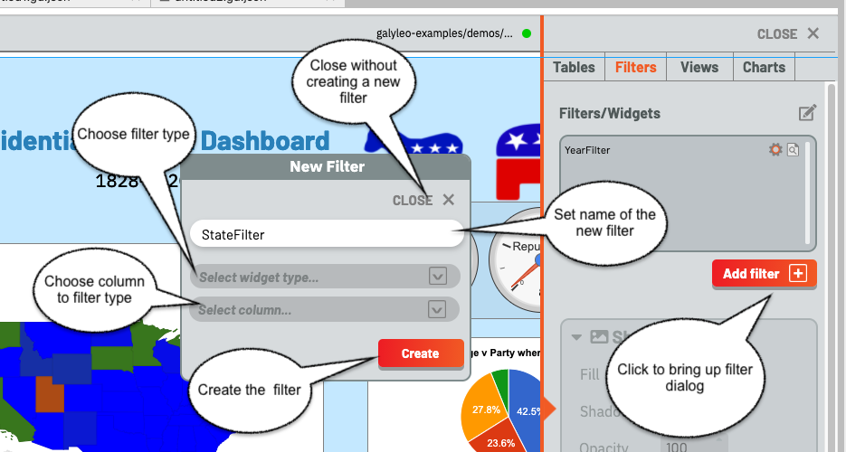

The filter must have a name, which cannot be the name of another filter or chart.  Type this in the input box, and select a widget type from the upper drop-down and a column name from the lower drop-down, then click create. Clicking "Close" closes the dialog without creating a new filter.

Various errors can occur during this process.  In particular, *Range* filters are only valid over numeric columns, and if a mismatched column is selected an error message will appear; the same message appears if a column is not chosen or a widget type is not chosen.  An error will display if a name is not entered, or if the name of another filter or chart is chosen.

Once the filter is created, it appears in the top-left corner of the dashboard.  The Filter is a physical object, and can be manipulated as with any other physical object on the dashboard, using the Halo and Sidebar as described above.  Put the dashboard into selection mode and move the filter as desired.

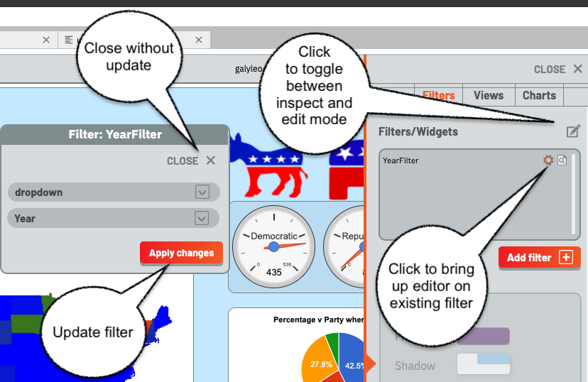

Clicking on the gear icon beside the name of an existing filter brings up a filter editor, as shown here.  The filter editor is very similar to the filter creator; it simply lacks an input for the filter name.  Choose column and widget, then Apply Changes to update the filter, or Close to close without update.  

Notice the pen icon is at the top right; once again, it is used to switch between inspection and edit modes, and filters are deleted in edit mode just as tables are, and with the same icon.

*Note*: Using the Halo to delete the Filter from the dashboard has the same effect as deleting it from the filter list.

Creating a View
---------------

Creating a View is very similar to creating a Filter, under the Views Tab.  Once again, there is an Add button below the lower-right corner of the views list.  Click this, and a popup is brought up, permitting the user to create a view.

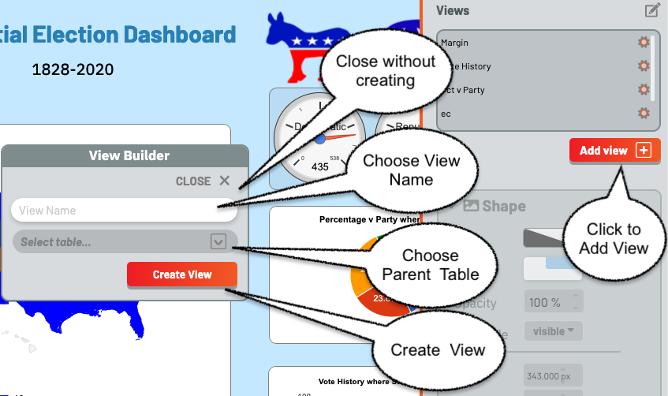

The view must have a name, which cannot be the name of another view or table.  Type this in the input box, and choose the underlying table from the  drop-down, then click create. Clicking "Close" closes the dialog without creating a new view.

An error will display if a name is not entered, or if the name of another view or table is chosen.

Once a View is created, it is immediately added to the View List, and a View editor is brought up.

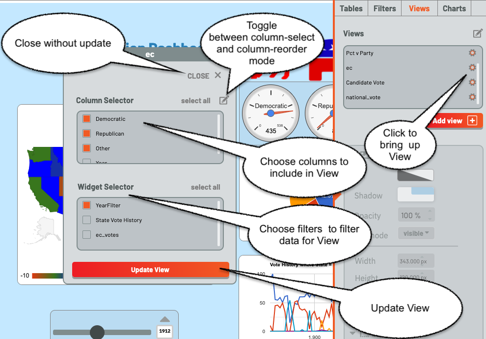

The View Editor is also brought up by clicking on the gear icon beside the name of a View.  It consists of two panels, a Column Chooser and a Filter Chooser.  The Column Chooser chooses the columns for the View, and the Filter Chooser chooses the filters which will be applied to the underlying table to get the rows for the View.  

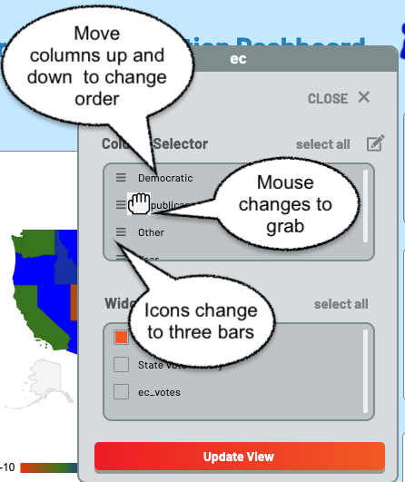

Since column order is important for a View, there is a column-order mode.  It is toggled by choosing the pen icon above the Columns list.  When it is toggled, the icons beside the column names change to three horizontal bars and the mouse changes to a grab icon.  The columns can then be dragged into order with the mouse.  Note that while all columns are displayed, only the order of selected columns are important.

As with tables and filters, views can be deleted using the pen icon above the view list to switch to edit mode, then deleting views in the same way tables and filters are deleted.

Creating a Chart
-----------------
Creating a Chart is very similar to creating a View, under the Charts Tab.  Once again, there is an Add button below the lower-right corner of the chart list.  Click this, and a popup is brought up, permitting the user to create a chart.

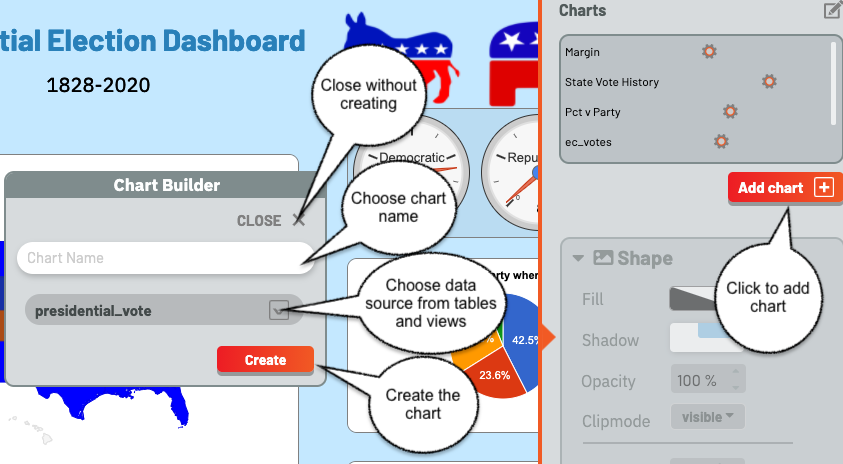

The chart must have a name, which cannot be the name of another chart or filter.  Type this in the input box, and choose the view or table to use as a data source from the  drop-down, then click create. Clicking "Close" closes the dialog without creating a new chart.

An error will display if a name is not entered, or if the name of another filter or chart is chosen.

Once a chart is created, it is immediately added to the chart List, the chart is brought up as a table on the dashboard, and the Chart Editor pops up.

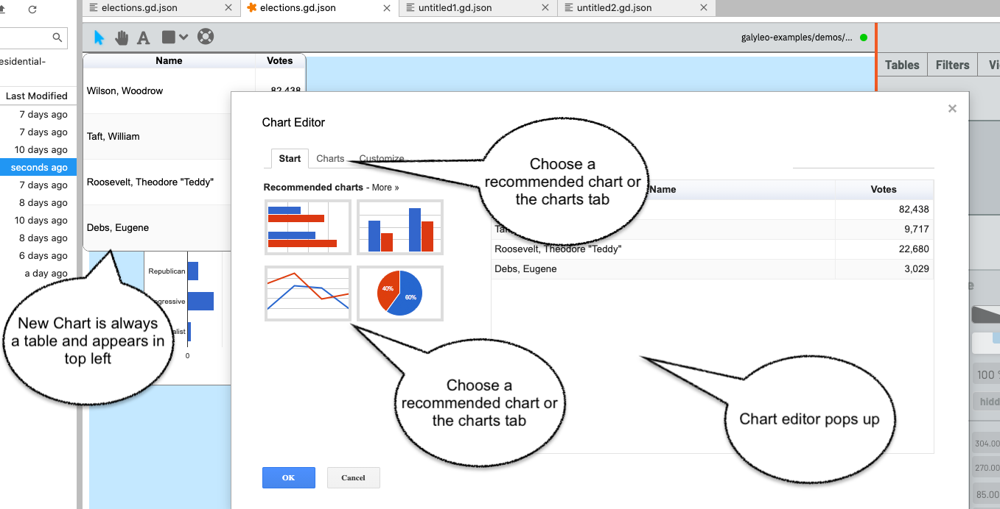

The Chart Editor is also brought up by clicking on the gear icon beside the name of a Chart.  

Once the Chart Editor pops up (it is the standard Google Chart Editor), choose the chart type either from the recommended charts on the start page, or click the Charts tab and then choose the chart type on the charts page.

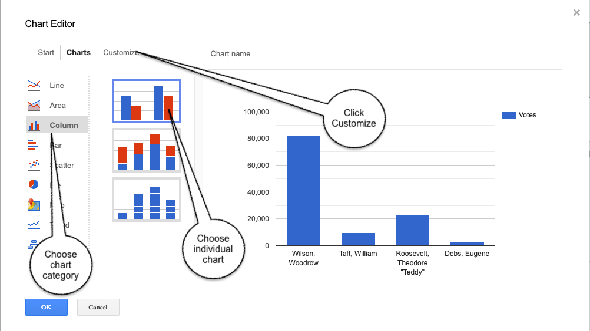

Then click customize and choose chart options.  We recommend that you *not* choose a title for the chart; Galyleo automatically generates a title based on the names of the columns chosen and the values of the filters used to drive the chart.

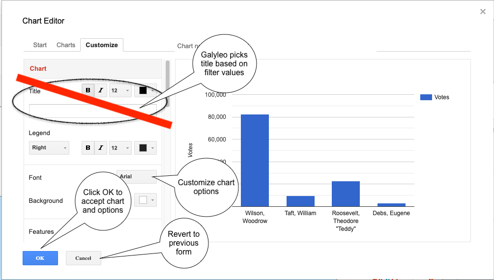

Once you're happy with the chart, click OK

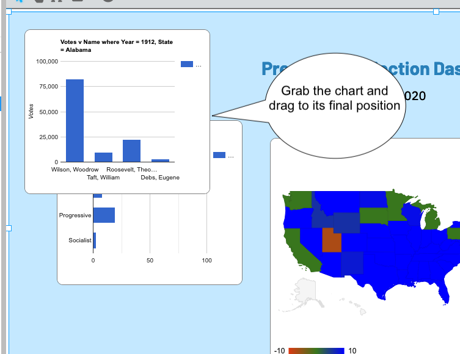

*Important note*.  When choosing Line or Area Charts, using the first column as X-axis labels (rather than a data series) must be explicitly chosen by checking "Use 1st Column as Labels" on the Start tab in the editor.

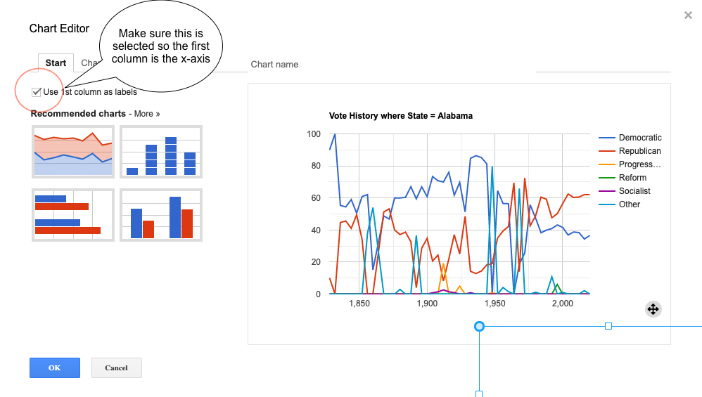

As with tables, filters, and views, charts can be deleted using the pen icon above the chart list to switch to edit mode, then deleting charts in the same way tables, filters and charts are deleted.  And, as with filters, deleting the physical chart with the Halo has the same effect as deleting charts from the chart list.

